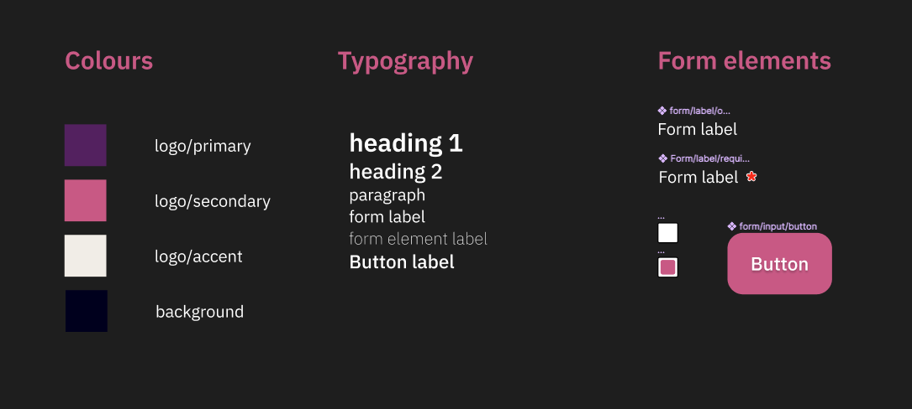

# Planning for A03 - Website planning, design and evaluation

## Week 1

### Team Meetings

#### First Meeting

The first meeting with your team is called a kickoff meeting.

During this meeting, you'll:

1. Choose your communication method
2. Define your client
3. Outline your work plan
4. Schedule future meetings

##### Choosing Your Communication Method

Decide the best way to keep in touch. It could be meeting in person, emailing, using a messaging app like Discord, or texting. The most important part is that everyone agrees and can use the chosen method.

##### Defining Your Client

Start by creating a description of your client. Understanding who your client is will influence many of your project decisions. Remember to refer to your client description regularly to ensure your project is on track. See _Part 1, requirement 03 | Client description_ for a list of thing to consider when describing your client.

##### Outlining Your Work Plan

Consider all the tasks you need to complete and plan how to tackle them as a team. It's also crucial to decide the order of tasks since some tasks depend on the completion of others.

##### Scheduling Future Meetings

Determine how often you'll meet. A good practice is to have a 10-minute check-in every two days throughout the project. These meetings are to ensure everyone is clear on their tasks and to identify and solve problems early. Adjust the frequency and length of these meetings as needed based on your project's progress.

### Week 2

For this week, we'll be focusing on several key areas: web psychology and design planning.

#### Web Psychology

Think about how you want to influence people's behavior on your website. What techniques could make your site more engaging for your target audience?

Write about the aspects of web psychology you plan to use. Why did you choose these techniques? How will they improve the user experience?

Remember, when considering web psychology, always think about what's best for the people visiting your site. How will your choices benefit them?

#### Design Planning

Start by thinking about the visual elements of your website.

- **Branding**: Begin with establishing your brand identity.
- **Color**: Choose colors that reflect your brand and appeal to your target audience. Think about how different colors can affect people's emotions and perceptions.
- **Typography**: Decide on the fonts you'll use for your website's text. Make sure they're easy to read and consistent with your brand.
- **Logo**: Sketch out various ideas for your logo. Once you've picked the best one, create a final version using design software.
- **Web layout**: Determine which pages your website will have and do thumbnails for both mobile and desktop versions. Collaborate with your team to finalize the layout.
- **Component design**: Think about the different elements your website will need, like headers, cards, navigation menus, buttons, forms, and footers. Sketch out rough designs for each of these components. Don't worry about making them perfect - the goal is to have a clear idea of what you'll need when you start prototyping your site in Figma.

If you want to learn more about using components in Figma, check out this Planet Diner video tutorial: [View IMM video on components in Figma](https://mediasite.algonquincollege.com/Mediasite/Channel/fd6bae31125c4077a2cbdeb961dc4e945f)

## Week 3

This week, we're focusing on making sure our designs work well for the people who will use them.

### Getting to Know the Users

- **Finding out about your users (dempographics)**: First, let's figure out who will be using our design. We'll talk about how we can learn about them and write down our plan.
- **Understanding your primary audience**: Let's think about the main group of people who will use our design. Who are they? What do they do? Why do they need what we're designing? Plan how you will present this in the assignment. It could be a paragraph, a chart, a list etc.
- **Create a persona for your primary audience**: Based on what we know about our main audience, let's create a character who represents them.
- **Understanding your secondary audience**: Now, let's think about another group of people who might also use our design. How can we describe them? Again, you can write a paragraph, make a chart, or list their characteristics, just like we did for the main audience.
- **Creating a persona for your secondary audience**: Based on what we know about our secondary audience, let's create another character who represents them.

### Planning Our User Research

With your team, figure out how you can learn more about your users. We'll decide what kind of tests we should do, how we'll do them, and why we chose these methods.

We'll also plan out how we'll share our research methods in our project and start writing a first draft.

Now that we know about our audience, let's take a look back at the colors and designs we chose last week. Do they still seem like good choices for the people who will be using our design?

We'll also check in on the psychology ideas we talked about last week. Do they still make sense for our audience? And can we see them in the sketches of our webpages?

### Getting Started with Figma

in class 13, we're exploring design systems. But you don't have to wait for the lesson to begin.

- **Collect Your Resources**: Start by gathering the necessary assets, such as images and your logo. Create a page in Figma titled "Assets" and import these resources there.
- **Building Your Design System**: Create another page in Figma named "Design System." Here's what to do on this page:
  - **Select Your Colors**: Prepare your color palette by adding squares representing each color. Ensure you include all the colors you plan to use.
  - **Define Your Typography**: List all the text elements you'll use, like headings, body text, and navigation items. Specify the font style for each. For example, indicate that your heading 1 should be in "Times New Roman, 24px, bold." Repeat this process for all text styles you'll use.

You will need to include all your elements in a design system, this is a start. You will eventually need to add all the elements of your design. For example, navigation items, buttons and form items.

Here is an example if text and colour in a design system.

If you're interested in learning about using components in Figma, check out this helpful video tutorial from Planet Diner: [Watch the Video Tutorial on Components in Figma](https://mediasite.algonquincollege.com/Mediasite/Channel/fd6bae31125c4077a2cbdeb961dc4e945f).
